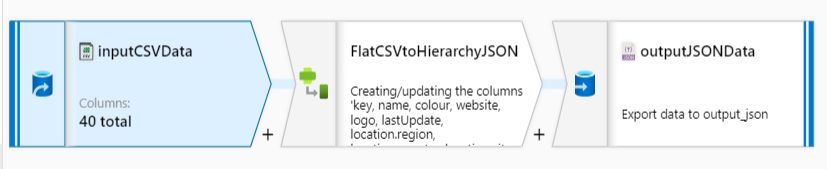

@Sarit Maitra
## Use case: Data Transformation
### Problem statement: Transform flat CSV data to multi-level hierarchical JSON format

Hypotheses: 
 1.	Hypothesis A:
   - Null Hypothesis (H0): Flat CSV file cannot be Unflatten to hierarchical JSON data structure
   - Alternate Hypothesis (H1): Flat CSV can be converted to multi-level hierarchical JSON format

 2.	Hypothesis B:
   - Null Hypothesis (H0): If above “Alternate Hypothesis A” can be proved, an automated scalable solution cannot be developed.
   - Alternate Hypothesis (H1): An automated scalable cloud solution can be developed considering the multi-level hierarchical transformation required.

Here, I have used python program to experiment with the given CSV dataset. It is advisable to use a subset of data to experiment; however, as the dataset is small, I have not opted for that option. The code is available @Code.py file. Objective is to do a pilot run and understand the feasibility of the project prior to going to cloud computing and spinning-up a cluster.
The observation is that, my python program worked in two stages:

   - converts the CSV data to JSON flat format.
   - unflatten the converted JSON data to hierarchical object. 
   
Here, I could see the possibility of developing an automated ETL pipeline to transform and clean data in required hierarchical structure. 

### Data flow:
  -	Fetch the CSV data from GitHub in the form of web pages using Azure Data Factory.
  -	Save the incoming data as CSV files in Azure Data Lake Storage.
  -	Leverage Azure DataFactory, especially DerivedColumn to change the schema to achieve cleansed and transformed data.
  - Validate and debug the pipeline to perform smoke test.

I have used Azure Data Factory with Data Flow and Pipeline Solution. Within DataFlow, I have used DerivedColumn as SchemaModifier to get the required output and finally ETL pipeline was build.
By using the Expression Builder inside of a Derived Column transform, I have defined the new hierarchical structure that includes arrays as shown below. 
As per requirement, the NaN entries in the csv file were translated in the output JSON in [] formats. I have used pipe (|) delimited field in ADF data flow expression language; this expression splits all values from that string and store each value as an array element. 

    "business": { 
    "valueChainPosition": [ 
        { 
        "name": "40f84db008a8374963eecad27f26ae53" 
        } 
    ], 
     "strategy": "b2d7b534b5d51a72dad2be2586b30f13", 
     "openSystem": "cfcd208495d565ef66e7dff9f98764da", 
     "technology": [ 
          { 
            "name": "3e5151615461e3999f26d793c68580f7" 
           } 
    ], 
      "keywords": []
      

Below is the image of the workflow in ADF for better understanding.

### Why ADF derived column?
In the current version of ADF derived column transformation, we can directly enter our expression text into the textbox without needing to open up the expression builder.
This has made the things quite easy to modify the schema and inspect the changes.

All the codes and pipeline have been validated. I have used ADF debug the created DataFlow and Pipeline successfully.

### Components used:
    
    - Azure Data Factory (ADF): hybrid data integration service to create, schedule, and orchestrate ETL/ELT workflow
    - Azure Data Lake Storage (ADLS): scalable and cost-effective storage 
    - GitHub: code repository & version control

Below is workflow diagram for better understanding:

References: 
  - https://docs.microsoft.com/en-us/azure/data-factory/data-flow-create

Below is the documentation on working with JSON in ADF Data Flows:
  - https://docs.microsoft.com/en-us/azure/data-factory/format-json

